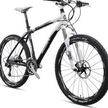
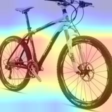

# Pytorch Implementation of Grad-CAM
[Grad-CAM:Visual Explanations from Deep Networks via Gradient-based Localization](https://arxiv.org/pdf/1610.02391)

## Dependency 
- python3
- pytorch
- torchvision
- scikit-image
- pillow
- opencv-python
- CUDA
- numpy
- argparse

## Examples



## Runing
*Note that before running **main.py**, you have to prepare the parameters of a model that has been trained previously. And the model parameters are save as "xxxxx.pth.tar".*

I have only run the attention map of ResNet on the "RealWorld", "Product" and "Art" domains of Office-Home. If you want to try other datasets or domains, please remember to add or fill the corresponding "image_num_list" and "class_name_list" in the code **main.py**.

```
python3 main.py --gpu_id 3 --arch resnet50 --dset office-home --image_path /data1/TL/data/office-home-65/RealWorld --weight_path the_model_weight_path/xxxxx.pth.tar --output_dir Results/RealWorld
```
