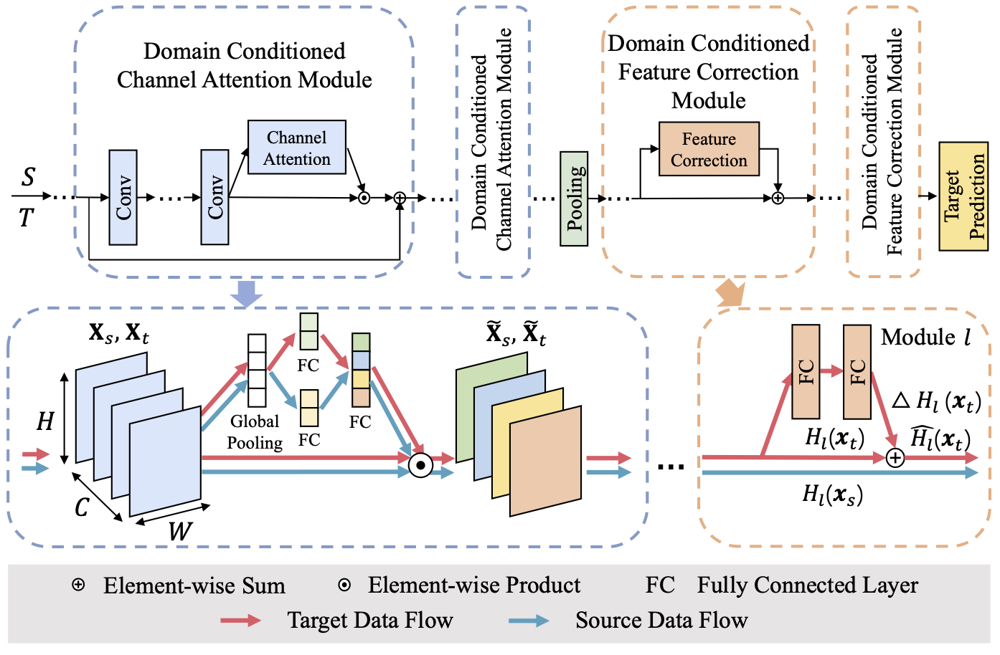

# Domain Conditioned Adaptation Network

## Paper



[Domain Conditioned Adaptation Network](https://arxiv.org/abs/2005.06717) 
(AAAI Conference on Artificial Intelligence, 2020)

If you find this code useful for your research, please cite our [paper](https://arxiv.org/abs/2005.06717):
```
@inproceedings{Li20DCAN,
    title = {Domain Conditioned Adaptation Network},
    author = {Li, Shuang and Liu, Chi Harold and Lin, Qiuxia and Xie, Binhui and Ding, Zhengming and Huang, Gao and Tang, Jian},
    booktitle = {Thirty-Fourth AAAI Conference on Artificial Intelligence (AAAI-20)},    
    year = {2020}
}
```

## Abstract
Tremendous research efforts have been made to thrive deep domain adaptation (DA) by seeking domain-invariant features. Most existing deep DA models only focus on aligning feature representations of task-specific layers across domains while integrating a totally shared convolutional architecture for source and target. However, we argue that such strongly-shared convolutional layers might be harmful for domain-specific feature learning when source and target data distribution differs to a large extent. In this paper, we relax a shared-convnets assumption made by previous DA methods and propose a Domain Conditioned Adaptation Network (DCAN), which aims to excite distinct convolutional channels with a domain conditioned channel attention mechanism. As a result, the critical low-level domain-dependent knowledge could be explored appropriately. As far as we know, this is the first work to explore the domain-wise convolutional channel activation for deep DA networks. Moreover, to effectively align high-level feature distributions across two domains, we further deploy domain conditioned feature correction blocks after task-specific layers, which will explicitly correct the domain discrepancy. Extensive experiments on three cross-domain benchmarks demonstrate the proposed approach outperforms existing methods by a large margin, especially on very tough cross-domain learning tasks.

## Prerequisites
The code is implemented with Python(3.7) and Pytorch(1.2.0).

To install the required python packages, run

```pip install -r requirements.txt ```

## Datasets

### Office-Home
Office-Home dataset can be found [here](http://hemanthdv.org/OfficeHome-Dataset/).

### DomainNet

DomainNet dataset can be found [here](http://ai.bu.edu/M3SDA/).

### Office-31
Office-31 dataset can be found [here](https://people.eecs.berkeley.edu/~jhoffman/domainadapt/).

## Pre-trained models

Pre-trained models can be downloaded [here](https://github.com/BIT-DA/DCAN/releases) and put in <root_dir>/pretrained_models


## Running the code
Office-Home
```
$ python train_dcan.py --gpu_id id --net 50 --output_path snapshot/ --data_set home --source_path data/list/home/Art_65.txt --target_path data/list/home/Clipart_65.txt --test_path data/list/home/Clipart_65.txt --task ac
```

DomainNet
```
$ python train_dcan.py --gpu_id id --net 50/101/152 --output_path snapshot/ --data_set domainnet --source_path /data/list/domainnet/clipart_train.txt --target_path data/list/domainnet/infograph_train.txt --test_path data/list/domainnet/infograph_test.txt --task ci
```

Office-31
```
$ python train_dcan.py --gpu_id id --net 50 --output_path snapshot/ --data_set office --source_path data/list/office/dslr_31.txt --target_path data/list/office/webcam_31.txt --test_path data/list/office/webcam_31.txt --task dw
```

## Acknowledgements
This code is heavily borrowed from [Xlearn](https://github.com/thuml/Xlearn) and [CDAN](https://github.com/thuml/CDAN).


## Contact
If you have any problem about our code, feel free to contact
- shuangli@bit.edu.cn

or describe your problem in Issues.
